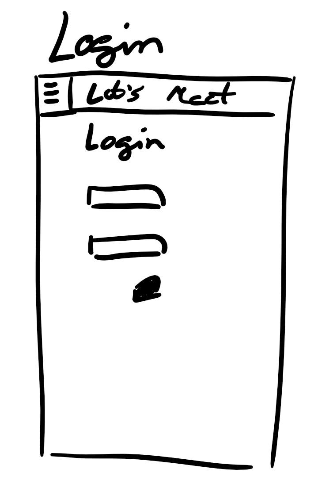
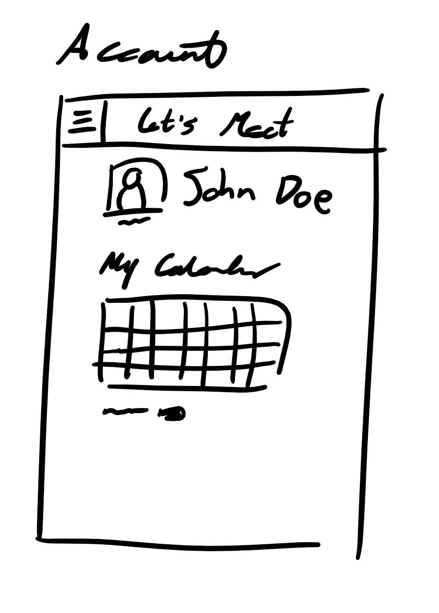
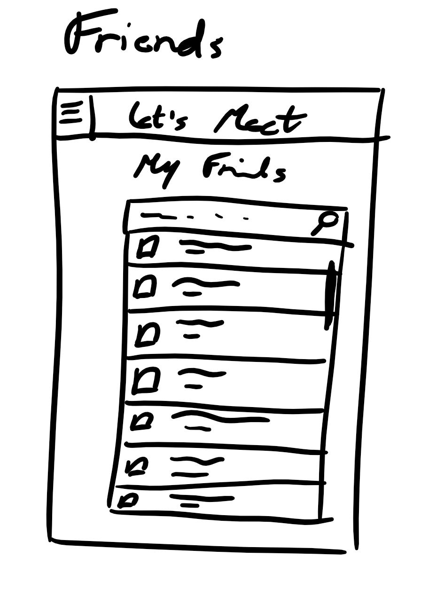
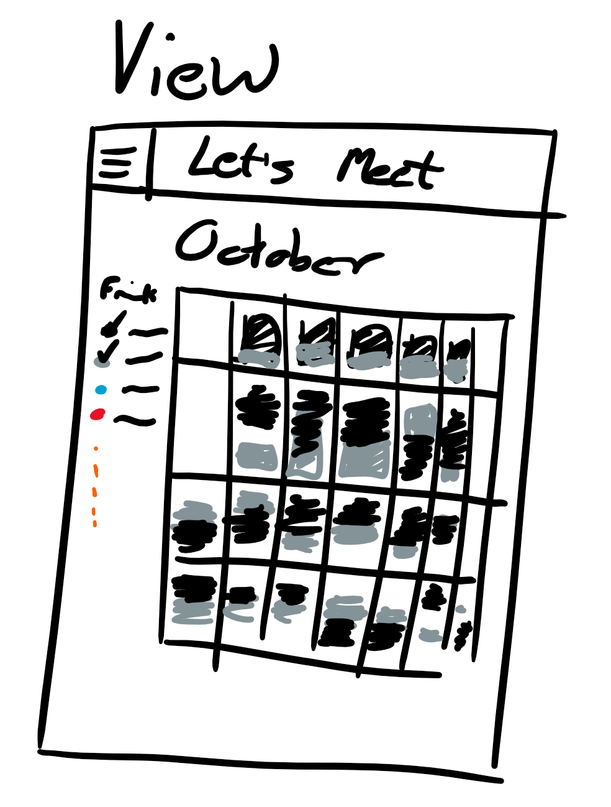
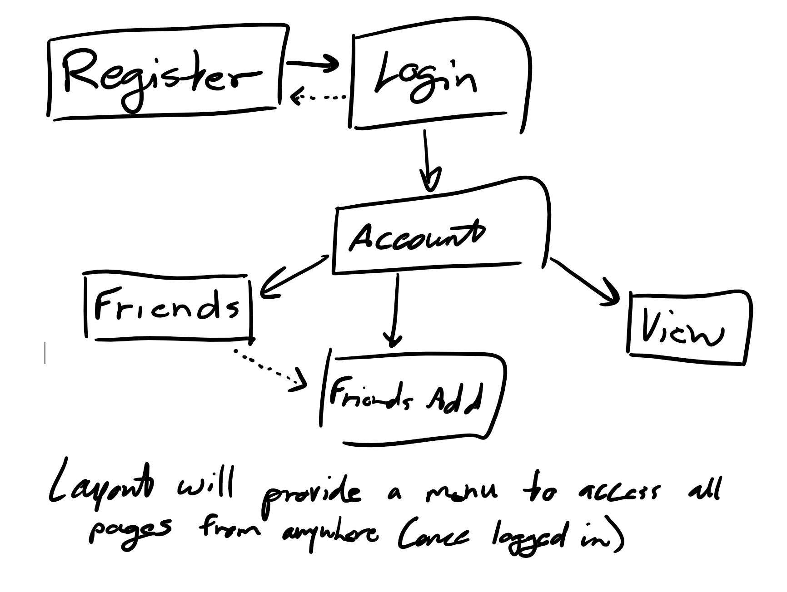

# Let's Hang (PUBLIC VERSION)

## Overview (updated 11/8)

Let's Hang is a social-focused calendar app. The objective is to inspire users to make use of their precious time and gather with others.

The app uses Mongodb Atlas to serve as the database for all users. Users will log in through Azure AD authentication. Then, through Microsoft graph, users will be able to access their calendars and their friends' calendars to find time to hang out! The process of finding free time will be automated, and the goal is to add features to promote socialization.

## Data Model

The application will store Users as documents in Mongodb

* users can have multiple friends (via references)

An Example User:

```javascript
{
  _id: someid,
  msid: microsoftid, // the id that links this user in Mongodb to their respective Microsoft-based account
  username: "Michael Mironidis", // the user's name as loaded by Azure AD
  bio: "NYU 2022" // a simple bio
  img_url: "someidprofile.png", // their profile picture for the app
  friends: [someid1, someid2] // an array of references to User documents
}
```

## [Link to Schema](src/db.js)

## Wireframes

/login - page for logging in to an account using Azure AD.



/logout - logs the user out (not a page, but it is a route)

/account - page for viewing / updating your account and other account-related activity



/friends - page for viewing your current friends list and searching for friends + adding new ones



/calendar - page for viewing calendars. Users can selected which (and any quantity) of their friends' calendars to also be visible in order to find free time to hang out.



## Site map



## User Stories or Use Cases

1. as non-registered user, I can register a new account with the site using my existing Outlook/Microsoft-based login
2. as a user, I can log in to the site using existing Outlook/MS login
3. as a user, I can view my calendar
4. as a user, I can compare my calendar to my friends' calendars in order to find time to meet.
5. as a user, I can update my account details unique to the Let's Hang app (in other words, Let's Hang has it's own social element above the Microsoft accounts it is linked to)

## Research Topics

* (2 points) Azure AD Authentication
* (3 points) Microsoft Graph REST API (primarily for calendar access)
* (2 points) Bootstrap
* (2 points) Grunt, Gulp, or Webpack to automate ESLint in workflow

9 points total out of 8 required

## [Link to Initial Main Project File](src/app.js) 

## Annotations / References Used

1. [grunt eslint setup tutorial](https://mattdufeu.co.uk/blog/getting-started-with-eslint-using-grunt/#:~:text=%20Getting%20Started%20with%20ESLint%20using%20Grunt%20,our%20project%2C%20you%20need%20a%20%E2%80%9C...%20More%20)
2. [grunt watch](https://mijingo.com/blog/watching-your-grunt-files-for-changes)
3. [Azure AD Auth + Graph REST API calendar tutorial](https://docs.microsoft.com/en-us/graph/tutorials/node)
4. [Bootstrap](https://getbootstrap.com/docs/4.0/getting-started/introduction/)

# Milestone 2 Summary | 11/9/2021

For this milestone, I did a lot of research discovering what it was I truly wanted from this app. My original idea of using .ics file uploads quickly became unrealistic when I realized just how inaccessible they really are. Exporting your calendar from outlook as .ics is quite cumbersome, and I'm not even sure it is possible from mobile calendar apps. On top of that, MSFT and Google already have fully-featured calendars and sharing. To avoid reinventing the wheel, I decided instead to take advantage of existing authentication and APIs to then build functionality and interesting features on top of.  

Thus, Let's Hang transitioned to Azure AD authentication and therefore takes advantage of Microsoft Graph and access to the calendar API. Authentication works fully, and the Mongodb Atlas database associates each user's account to their corresponding Microsoft account.  

Besides Microsoft services, my dev environment employs grunt for linting. In addition, a deeper dive into Bootstrap has been made, utilizing cards for an easy, modern look, modified to my liking.

Looking forward, the app is becoming more focused. It is a social-focused social media app that inspires professionals to enjoy more casual experiences with friends or acquaintances. The app will provide social-focused features intended on streamlining and destressing finding time to hang out with others.  

# Milestone 3 Summary | 11/19/2021

For this milestone, I implemented accessing user calendar data, outputting it a table, and adding events to outlook calendars. I also implemented a live search functionality on the friends tab that queries all users.

Calendar data is accessed and created through the graph API. For now, when adding an event, just insert your user's email. The test email is letshangtest@outlook.com
After submitting the event, you will see it added in the calendar page, but it is also added in their outlook calendar!

The live search functionality uses socket.io. The search algorithm right now is quite "dumb", in that it is a simple regex and has no limit in query results. Fuzzy search would also be a long term goal, although the app is not intended to be used like facebook/instagram/etc where random people follow each other, so users should already know each other's usernames when searching if they are friends/acquaintances.

For the next milestone, I intend to flesh out the friends tab to feature actually adding friends, searching within your own friends only, a much better looking calendar interface (currently just a table), and the group calendar scheduling feature.

Due to time limitations, I am considering the scheduling feature to involve the following flow:
* choose a day to hang out
* find empty time in the day
* create an event easily for a selected time range
This is instead of my intended layering of calendars on top of each other, which seems extremely difficult unless I find a way to accurately depict the blocks of time each event takes.

# Final Submission Summary | 11/30/2021

For this milestone, I implemented friend requesting and accepting functionality, modals for quick account viewing, sharing your next week of events to your Let's Hang account for your friends to see when planning, viewing events of any selection of one's friends along with their own, and finally, when adding new events, instead of typing each email and delimiting with semicolon, users have the option to use an interactive interface when focusing on the attendees section of the form, selecting from their friends in a pop-up menu, which properly formats the input. The app also experienced an overhaul of styling and layout, taking greater advantage of Bootstrap's built in functionality to create a dynamic navbar that becomes a hamburger menu under the right conditions, and use of modals for quickly viewing a user's profile and accepting or sending friend requests.

Looking to the future, I intend to design my own attractive calendar UI, since a table of events isn't very pretty. I also intend to implement more privacy/security features, allowing users to choose if they want the subject line of their events visible to friends, and possibly encrypting events in my database.
